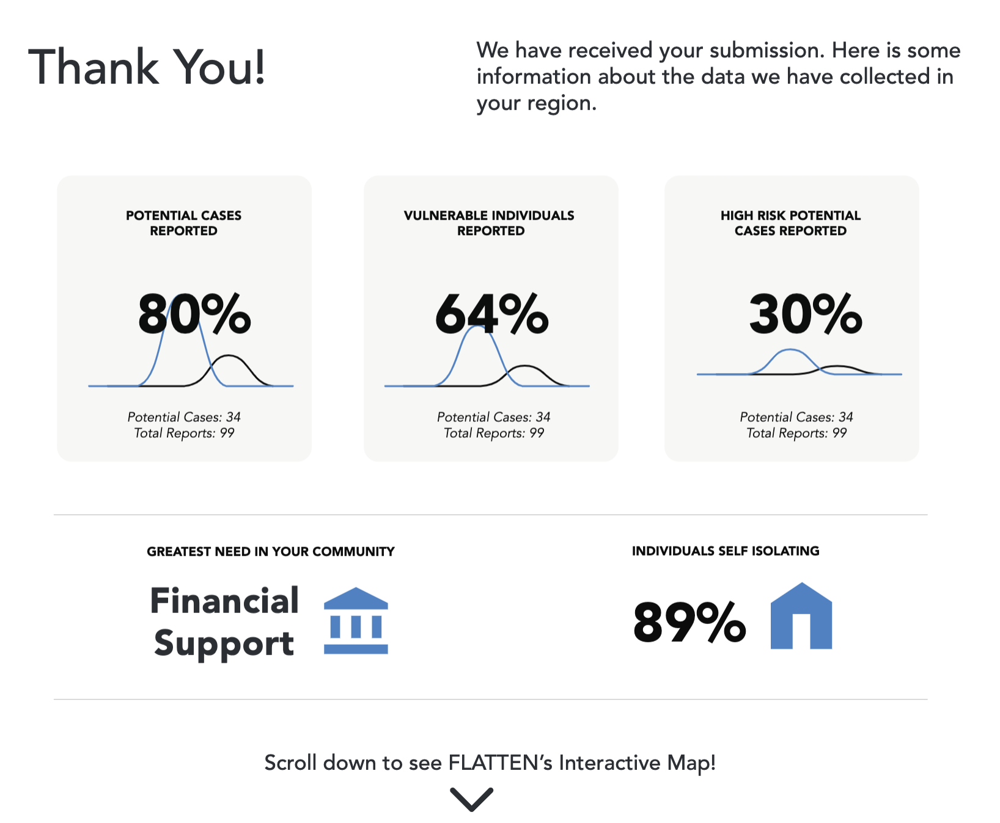

# Flatten Images

Project to dynamically generate images based off of our data.

## Setting up

You will need [NodeJS](https://nodejs.org/en/). Once this is installed, run `npm install` from the root directory.

To run the server, use `node src/index.js`, and navigate to the URL that it gives you. The server is currently set up
so we can serve the images directly to your browser for testing, but this will be moved so that they push to a cloud storage bucket.

## Architecture

The current plan is to run this project as a Google App Engine instance that periodically pushes to a
cloud storage bucket after being triggered by a cron trigger.

We are going for an end product somewhat similar to this mockup:

